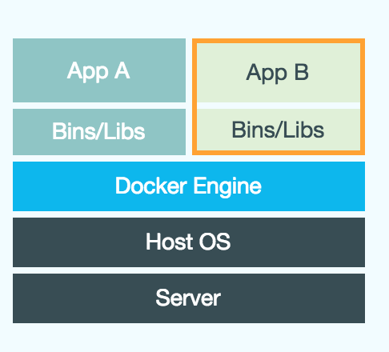
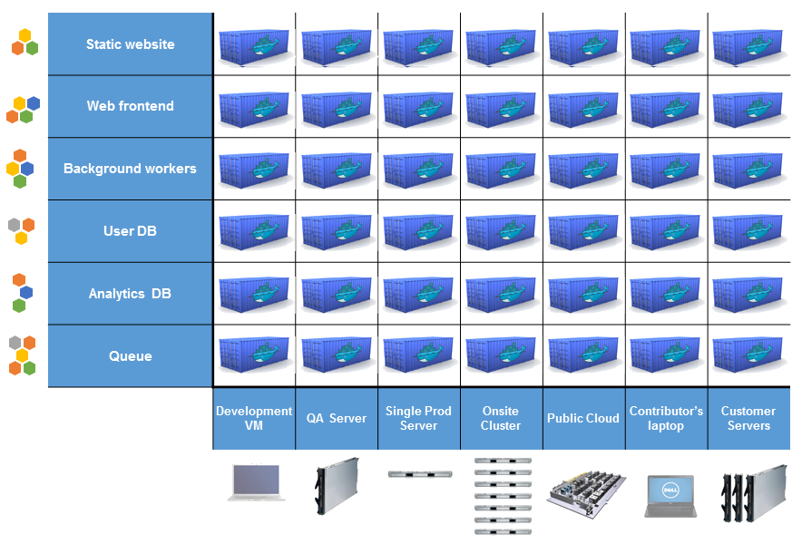
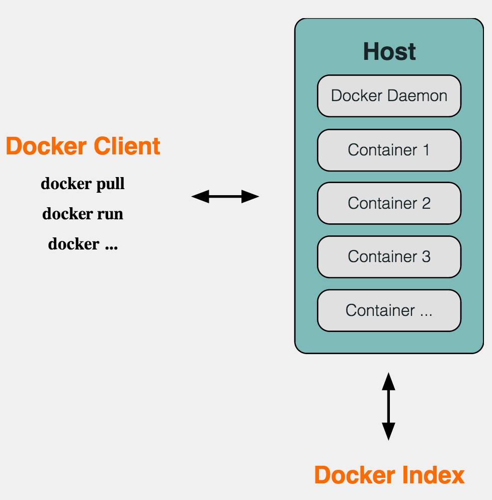
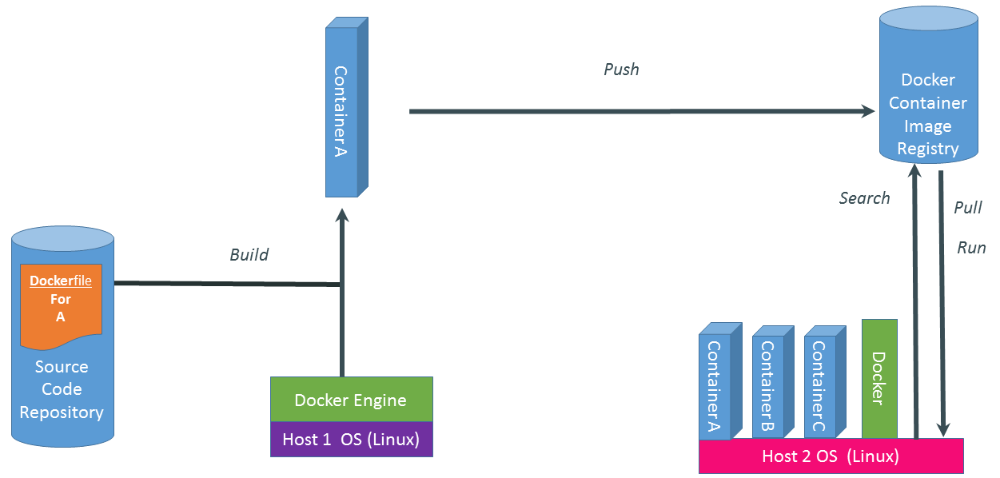

# Docker的介绍
Docker可以说是Go语言里面的killer app, 正是随着Docker的流行，越来越多的云计算公司采用Go语言作为他们的主要开发语言，例如corsOS、Google Cloud Platform等公司。那么为什么Docker会如此之火呢？让我们一层一层剥开Docker的神秘面纱，看看它到底好在哪里？

## Docker和虚拟机的区别

可能今年大家都听说过Docker，那么这条大鲸鱼到底是干嘛的呢？Docker其实就是虚拟化的延伸，我们常见的虚拟机有VirtualBox，VMware等，传统的那些云计算厂商，如AWS，阿里云，UCloud等云主机系统都是建立在虚拟机之上的，那么他们这些云主机是怎么运行的呢？基本上都是如下图所示的架构:

可以看到传统的虚拟云主机是建立在Host主机之上一个全新的操作系统，利用虚拟技术来进行全新的各方面的隔离，所以我们要发布一个应用，除了包含了你的应用之外，还包含了体积庞大的操作系统，这不仅使得应用跑的性能低下，还使得应用无法方便的移植，因为依赖于系统。

但是Docker的改进之处就是变得非常的轻量级，Docker是基于Host主机之上的一个进程应用，利用了Linux的内核特性虚拟化，运行一个contrainer和运行一个进程一模一样，所以可以很快速的启动一个应用，而且app之间又很好的隔离了。这解决了传统虚拟机的两个痛点，1：不需要新装系统，2：可以自由的移植，因为是基于同一个内核运行的，所以编译一次，可以扔到任意Docker Engine支持的系统上运行。目前Docker不支持windows，但是随着Docker目前的发展趋势，支持windows是迟早的事情，目前的架构设计也在朝着支持的方向走。

## Docker的目标
简单的一句话就是：编译一次到处运行，请看下面这个比较形象的图

大家都知道集装箱是用来封装各种不同的货物，封装之后就可以让各种交通工具运输，Docker也是采用了同样的理念，不同的应用采用Docker封装起来，然后通过image传输，在目标系统中运行起来就可以。这样就标准化了我们应用的环境接口，Docker engine就可以做这些工作。

## Docker的架构
Docker的成功还在于他设计的这个C/S架构，小而美的架构设计，而且扩展设计都非常好，我们先来看一个整体的设计图：

上面这个架构我们可知Docker主要分成三个部件：

- Docker Daemon
- Docker Client
- Docker Registry

## Docker的技术基础

- Namespace
- Control Group
- UnionFS
- LXC

## Docker的操作流程

